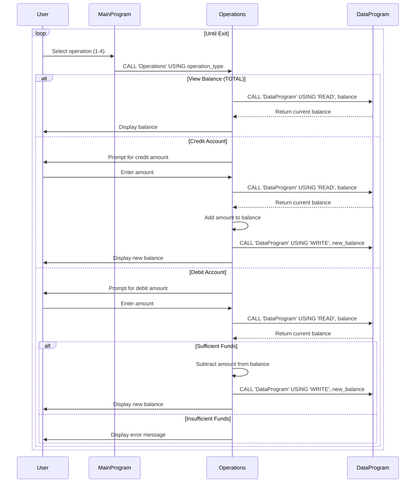

# COBOL Student Account Management System

This repository contains a legacy COBOL-based system for managing student accounts. The system allows viewing balances, crediting accounts, and debiting accounts while enforcing basic business rules.

## COBOL Files Overview

### data.cob
**Purpose**: Handles data persistence for account balances. Acts as a simple data storage module.

**Key Functions**:
- `READ`: Retrieves the current balance from storage.
- `WRITE`: Updates the balance in storage.
- Uses a shared balance variable initialized to $1000.00.

**Business Rules**: None directly; serves as data layer.

### main.cob
**Purpose**: Main entry point and user interface for the account management system. Provides a menu-driven console application.

**Key Functions**:
- Displays a menu with options: View Balance, Credit Account, Debit Account, Exit.
- Accepts user input and calls appropriate operations.
- Loops until user chooses to exit.

**Business Rules**: None directly; orchestrates user interactions.

### operations.cob
**Purpose**: Implements the core business logic for account operations.

**Key Functions**:
- `TOTAL`: Displays the current account balance.
- `CREDIT`: Adds a specified amount to the account balance.
- `DEBIT`: Subtracts a specified amount from the account balance, if sufficient funds are available.

**Business Rules Related to Student Accounts**:
- **Sufficient Funds Check**: Debits are only allowed if the account balance is greater than or equal to the debit amount. If insufficient funds, the operation is rejected with a message.
- **No Overdraft**: Prevents negative balances by enforcing the sufficient funds rule.
- **Balance Persistence**: All changes are persisted through the data module.
- **Initial Balance**: Accounts start with a default balance of $1000.00 (simulated in code).

## System Architecture
- `main.cob` calls `operations.cob` with operation types.
- `operations.cob` calls `data.cob` for reading/writing balance data.
- All programs use COBOL linkage sections for parameter passing.

## Usage
Compile and run `main.cob` to start the interactive system. Follow on-screen prompts to perform account operations.

## Sequence Diagram

